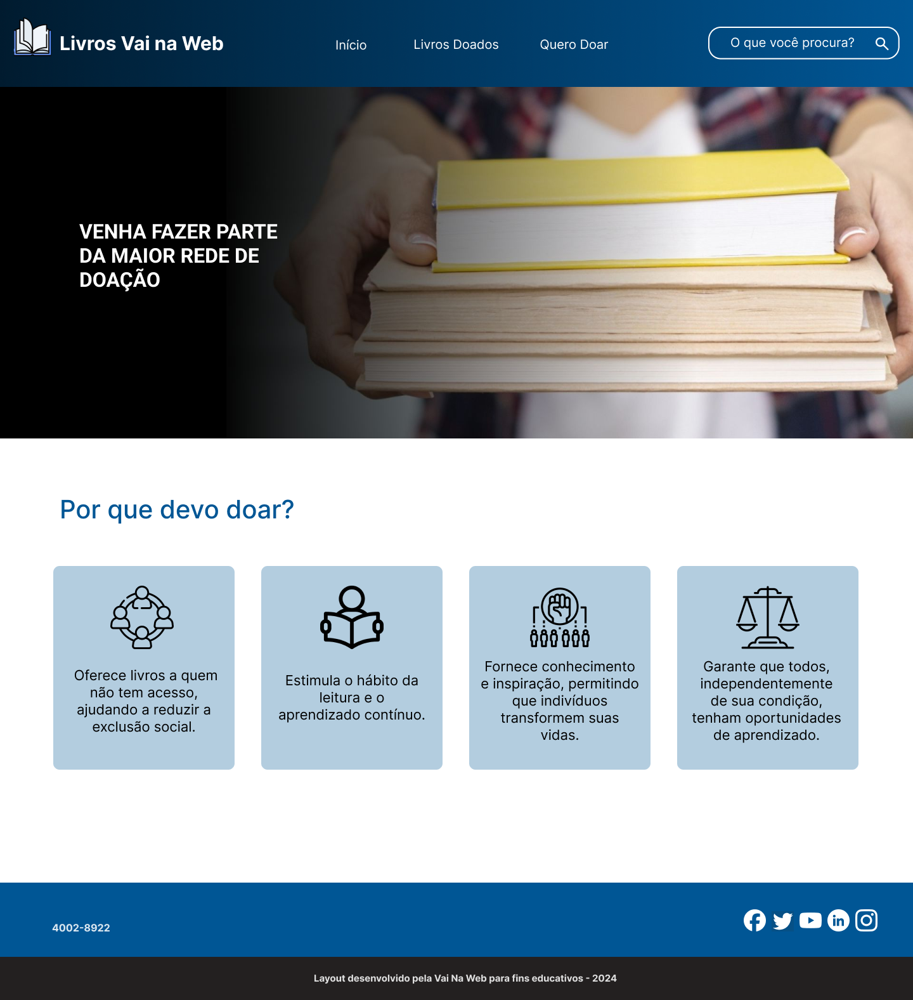

#  Livros Vai na Web
Projeto final do módulo de Frontend da Formação Full Stack da [@vainaweb](https://www.instagram.com/vainaweb/)

## 🔥 Introdução
Site desenvolvido com o objetivo de colocar em prática os conhecimentos adquirido no módulo *Frontend* da formação.

## 📦 Tecnologias usadas:
- Vite
- React
- React Router Dom
- Sass
- Lucide Icons

## 👷 Autores
- **Tatyane Gonçalves** - *Desenvolvedora* - [@tatyanepgoncalves](https://github.com/tatyanepgoncalves)
- **Equipe Vai na Web** - *Criador e educador técnico* - [@vainaweb](https://www.instagram.com/vainaweb/)

  

